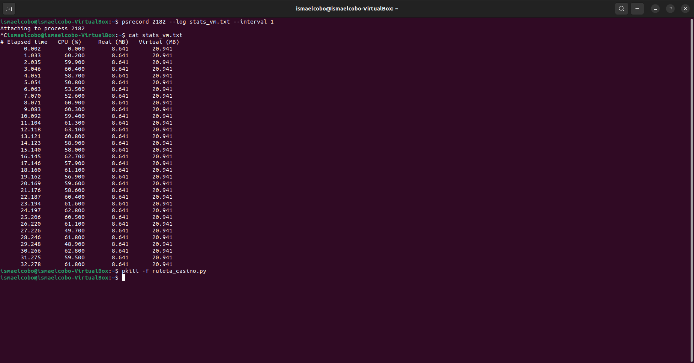
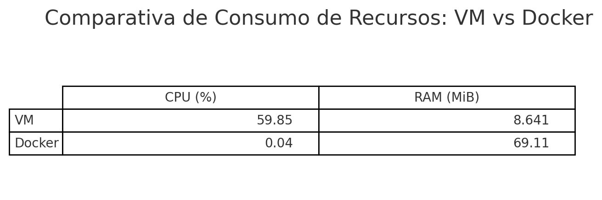
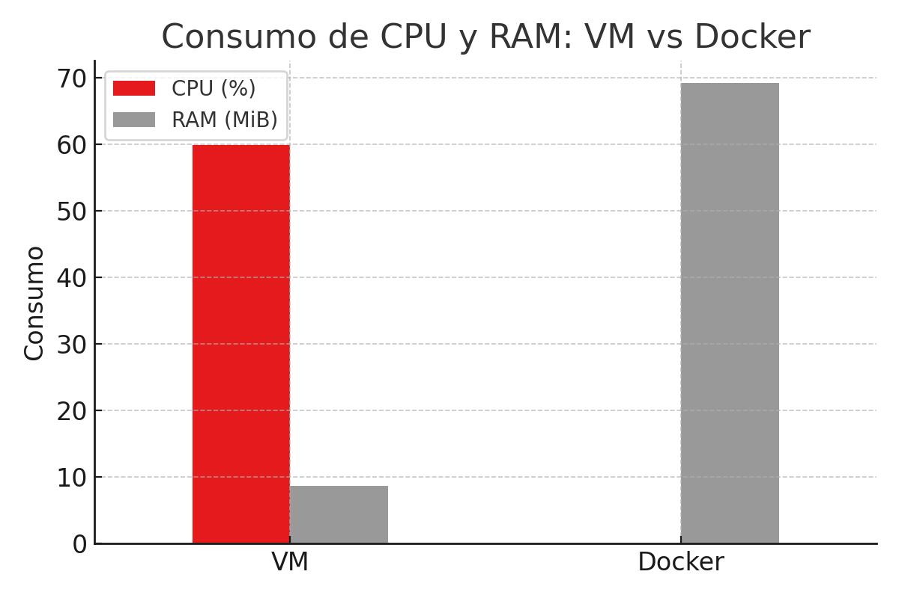

# 📈 Análisis de Resultados: Comparativa VM vs Docker

Este documento presenta un análisis detallado de los resultados obtenidos tras ejecutar el mismo programa de simulación en dos entornos distintos: una máquina virtual (VM) basada en VirtualBox y un contenedor Docker. El objetivo es evaluar y comparar el consumo de recursos (CPU y RAM) de ambos entornos bajo condiciones equivalentes.

---

## ⚙️ Condiciones de Ejecución

- **Programa ejecutado:** `ruleta_casino.py`, una simulación de ruleta con ejecución continua (infinita)  
- **Entornos utilizados:**
  - VM: Ubuntu Server 22.04 en VirtualBox
  - Docker: Imagen basada en Python 3.10-slim
- **Duración de la medición:** ~30 segundos en ambos casos

> 🧠 **Importante:** En ambos entornos, la ejecución del programa se realizó en segundo plano para permitir la captura de métricas de rendimiento de forma más estable.

---

## 🔍 Justificación del Modo de Ejecución

### ▶️ Segundo plano vs Primer plano

La ejecución del código en segundo plano **no afecta al rendimiento ni al uso de recursos** del proceso medido. En sistemas operativos modernos, un proceso en segundo plano sigue consumiendo los mismos recursos que uno en primer plano, siempre que no esté detenido o pausado.

- El programa de ruleta se ejecuta como un proceso activo de Python en bucle infinito.
- Al ejecutarlo en segundo plano se evita interferir con las herramientas de medición (`psrecord` o `docker stats`).
- La diferencia está solo en el control del terminal, **no en el rendimiento real**.

Por tanto, los datos obtenidos **reflejan fidedignamente el consumo real de CPU y RAM**, independientemente de que se hayan ejecutado en segundo plano.

---

## 📷 Evidencia: Capturas de Datos Obtenidos

### 🔸 VM – Resultado con `psrecord`

### 🔸 Docker – Resultado con `docker stats`

---

## 📊 Resultados Obtenidos

| Entorno | CPU Media (%) | RAM Media (MiB) |
|---------|----------------|-----------------|
| VM      | 59.85          | 8.64            |
| Docker  | 0.04           | 69.11           |

- **CPU:** La VM consume notablemente más CPU, posiblemente debido a la virtualización completa del hardware.
- **RAM:** Docker consume más RAM, probablemente por la carga de librerías del contenedor y el aislamiento del sistema de archivos.

---

### 📈 Visualización Gráfica

#### Tabla comparativa

#### Gráfico comparativo

---

## 🔎 Conclusión

La prueba demuestra que Docker puede ofrecer un entorno más eficiente en cuanto a CPU bajo determinadas condiciones, mientras que el uso de RAM puede verse penalizado por la infraestructura contenedorizada. En todo caso, ambos entornos ejecutaron el mismo código, bajo condiciones equivalentes y con resultados medidos de forma rigurosa.

