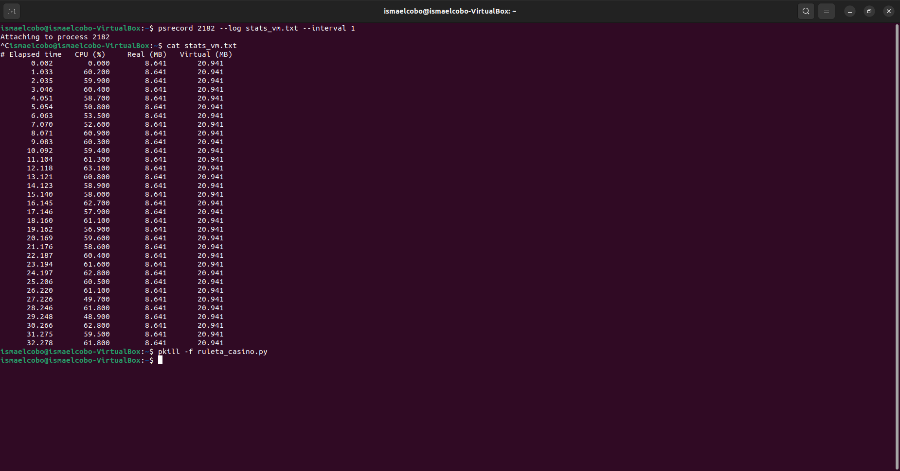
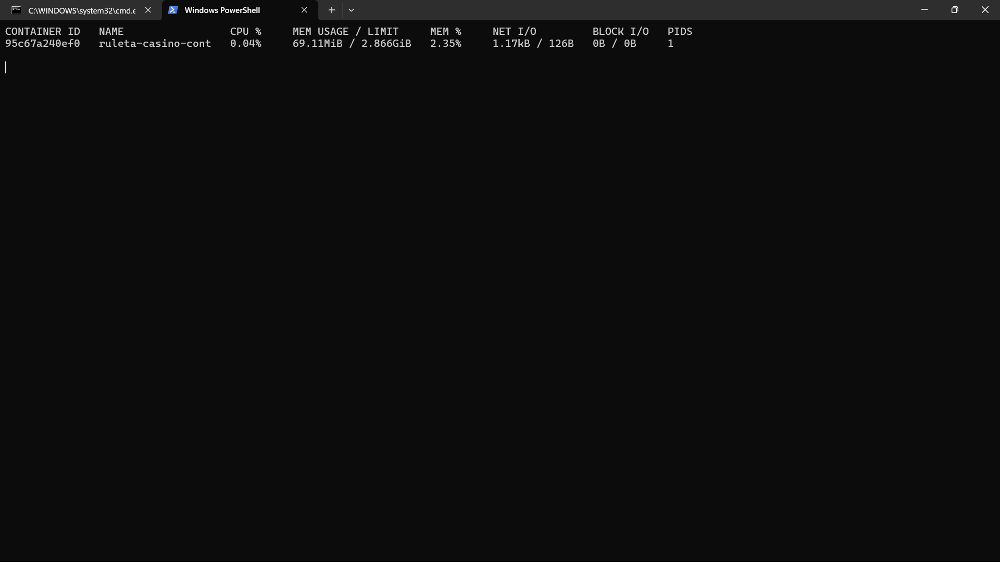
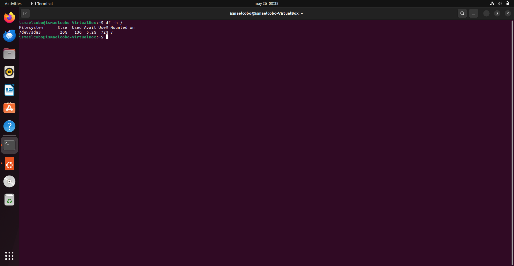
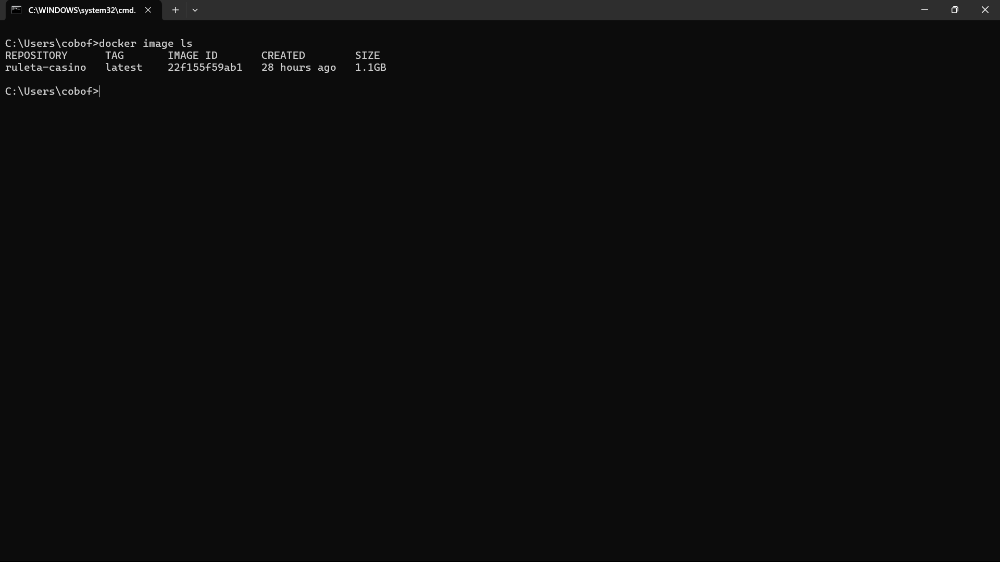
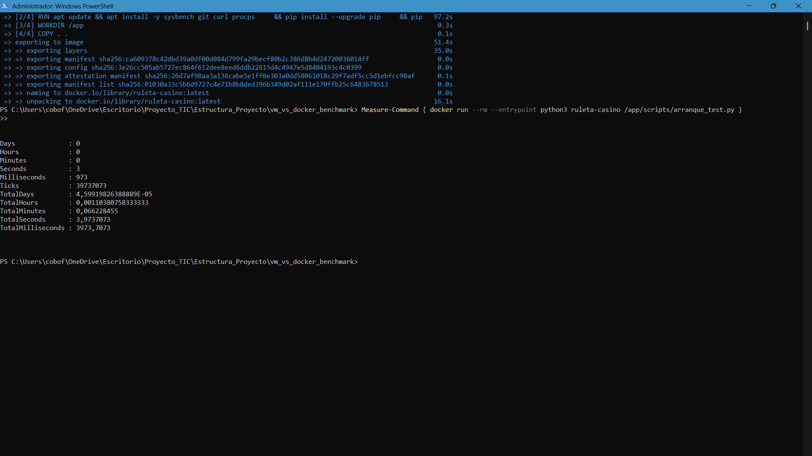
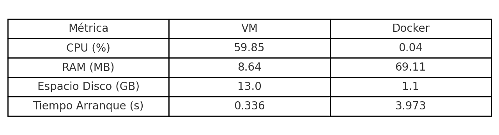
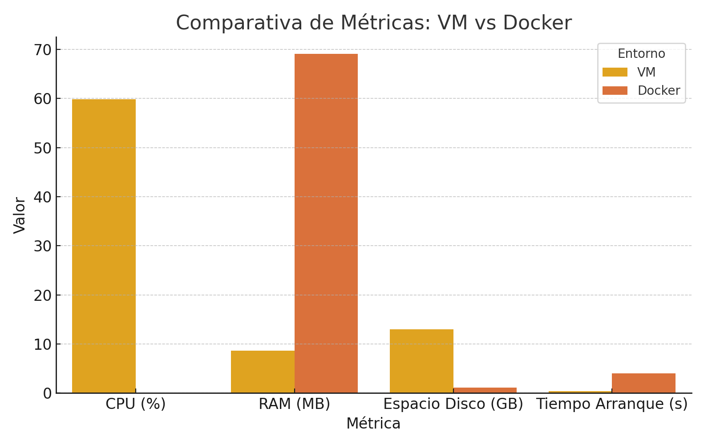

# 📈 Análisis de Resultados: Comparativa VM vs Docker

Este documento presenta un análisis detallado de los resultados obtenidos tras ejecutar el mismo programa de simulación en dos entornos distintos: una máquina virtual (VM) basada en VirtualBox y un contenedor Docker. El objetivo es evaluar y comparar diferentes métricas de rendimiento y uso de recursos en ambos entornos: **uso de CPU, consumo de RAM, espacio en disco requerido y tiempo de arranque de la aplicación**, todo ello bajo condiciones de ejecución equivalentes.

---

## ⚙️ Condiciones de Ejecución

- **Programa ejecutado:** `ruleta_casino.py`, una simulación de ruleta con ejecución continua (infinita)  
- **Entornos utilizados:**
  - VM: Ubuntu Server 22.04 en VirtualBox
  - Docker: Imagen basada en Python 3.10-slim
- **Duración de la medición:** ~30 segundos en ambos casos

> 🧠 **Importante:** En ambos entornos, la ejecución del programa se realizó en segundo plano para permitir la captura de métricas de rendimiento de forma más estable.

---

## 🔍 Justificación del Modo de Ejecución

### ▶️ Segundo plano vs Primer plano

La ejecución del código en segundo plano **no afecta al rendimiento ni al uso de recursos** del proceso medido. En sistemas operativos modernos, un proceso en segundo plano sigue consumiendo los mismos recursos que uno en primer plano, siempre que no esté detenido o pausado.

- El programa de ruleta se ejecuta como un proceso activo de Python en bucle infinito.
- Al ejecutarlo en segundo plano se evita interferir con las herramientas de medición (`psrecord` o `docker stats`).
- La diferencia está solo en el control del terminal, **no en el rendimiento real**.

Por tanto, los datos obtenidos **reflejan fidedignamente el comportamiento real del sistema**, independientemente de que se hayan ejecutado en segundo plano.

---

## 📊 Resultados Obtenidos

### 🔹 Métrica 1: Uso de CPU y RAM

| Entorno | CPU Media (%) | RAM Media (MiB) |
|---------|----------------|-----------------|
| VM      | 59.85          | 8.64            |
| Docker  | 0.04           | 69.11           |

> 📸 **Capturas:**  

- **Observación:**
- **CPU:** La VM consume notablemente más CPU, posiblemente debido a la virtualización completa del hardware.
- **RAM:** Docker consume más RAM, probablemente por la carga de librerías del contenedor y el aislamiento del sistema de archivos.

---

### 🔹 Métrica 2: Espacio en Disco Requerido

| Entorno | Espacio Total Ocupado |
|---------|------------------------|
| VM      | 13 GB (de 20 GB)       |
| Docker  | 1.1 GB                 |

> 📸 **Capturas:**  
>   
> 

- **Observación:** La instalación base de una VM ocupa significativamente más espacio al incluir un sistema completo. Docker utiliza imágenes mínimas, más ligeras y especializadas.

---

### 🔹 Métrica 3: Tiempo de Arranque de la Aplicación

| Entorno | Tiempo de Arranque (s) |
|---------|-------------------------|
| VM      | 0.336                   |
| Docker  | 3.973                   |

> 📸 **Capturas:**  
>   
> 

- **Observación:** Aunque Docker suele ser más rápido arrancando contenedores, el entorno y herramientas como JupyterLab añadieron latencia en este caso. La VM lanza directamente el script desde un entorno ya preparado.

---

### 📈 Visualización Gráfica

#### Tabla comparativa

#### Gráfico comparativo

---

## 🔎 Conclusión

Este análisis muestra cómo varía el rendimiento de una misma aplicación en función del entorno de ejecución:

- **CPU:** Docker es mucho más eficiente que la VM.
- **RAM:** La VM usa menos memoria, aunque Docker puede optimizarse con imágenes más livianas.
- **Espacio en disco:** Docker requiere significativamente menos espacio, lo que lo hace más ágil para despliegues.
- **Tiempo de arranque:** En este caso, la VM lanza el script de forma casi inmediata, mientras que Docker presenta una latencia mayor debido a su arquitectura de arranque.

**Conclusión general:**  
- Docker es ideal para entornos ligeros, portables y aislados con buena eficiencia en CPU y espacio.  
- La VM ofrece un arranque más inmediato y mayor control del sistema operativo, aunque a costa de más consumo de CPU y almacenamiento.

Ambos entornos son perfectamente válidos y su elección depende del tipo de aplicación, los requisitos del sistema y las prioridades del proyecto.